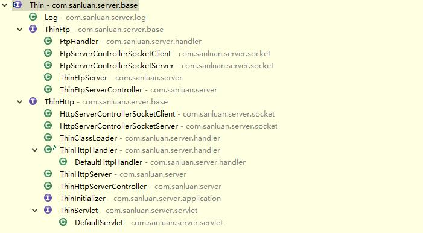
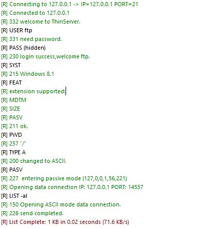
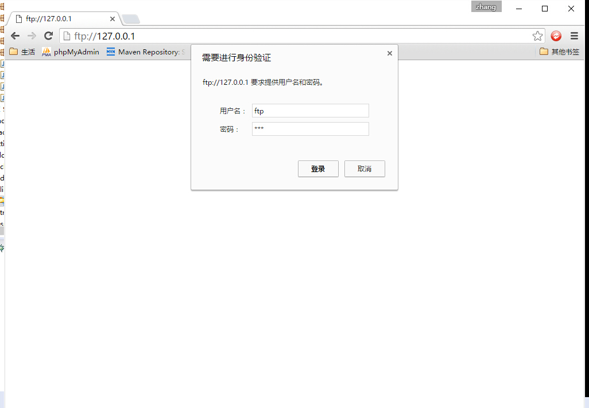
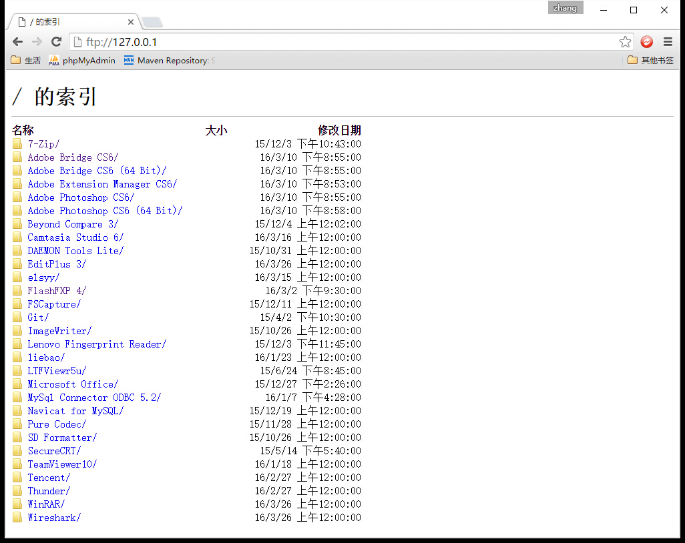
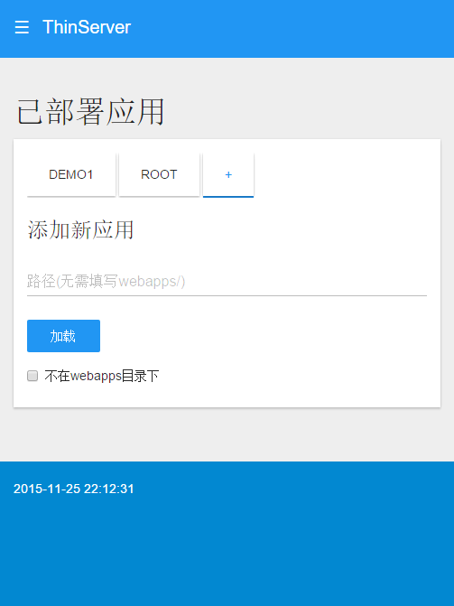

#T hinServer

## 简介
ThinServer是基于JDK提供的HttpServer开发的Web服务容器和以socket开发的ftp server，体积小，主程序jar包只有43k。两种服务均可使用socket远程管理

提供windows，linux启动、停止脚本。

其中http server

Http应用开发简单只需要实现com.sanluan.server.application.ThinInitializer，com.sanluan.server.servlet.ThinServlet接口即可

默认的Servlet实现已经支持普通html文件等的http服务。所以这个容器也可以用来将某个目录发布为web站点。

代码中附带三个例子分别是ROOT（容器管理应用），demo1（FreeMarker实现动态示例），gpio4pi（通过遥控或网页控制4路开关示例）

    gpio4pi的硬件设备与线路实现参考：http://www.publiccms.com/2015/11/05/709.html

执行bin/startHttp启动容器，执行bin/stopHttp停止程序。http服务默认端口：80；socket控制管理端口：8010，如果需要修改，请在脚本中添加参数

    -Dcom.sanluan.server.ThinHttpServer.port=http端口

    -Dcom.sanluan.server.ThinHttpServer.controlPort=http控制端口

conf/http.conf文件中可以配置默认加载的应用，grant 应用名 为授权该应用可以控制整个容器

其中ftp server

执行bin/startFtp启动容器，执行bin/stopFtp停止程序。ftp服务默认端口：21；socket控制管理端口：2121，如果需要修改，请在脚本中添加参数

    -Dcom.sanluan.server.ThinFtpServer.port=ftp端口

    -Dcom.sanluan.server.ThinFtpServer.controlPort=ftp控制端口

    -Dcom.sanluan.server.ThinFtpServer.rootPath=ftp跟目录，默认为空

conf/ftp.conf文件中可以配置ftp用户格式为：用户@密码@路径 或 用户@路径(此时用户不需要密码即可访问) 或 用户(此时用户不需要密码，工作目录为环境中指定的目录)

欢迎一起学习和交流

## 授权
该软件永久开源免费(MIT 授权协议)

